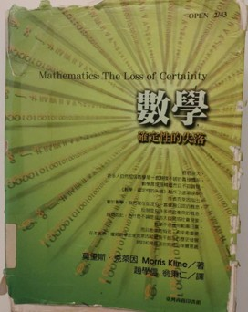
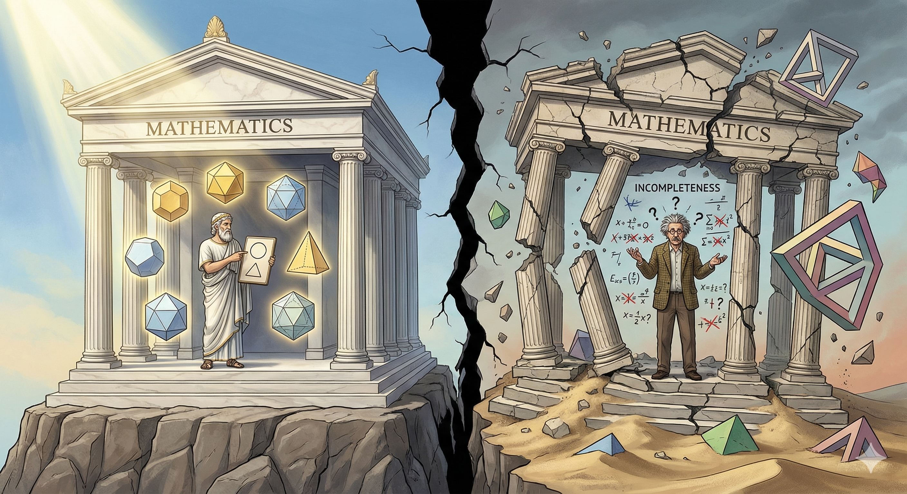

《數學：確定性的失落》（Mathematics: the Loss of Certainty） 是應用數學家、數學史學家、數學哲學家Morris Kline在1980所著的數學史和數學哲學的科普著作（還是應該說是：數普？）；中文版由趙學信與臺大數學系教授翁秉仁翻譯，於2004年出版。

{#fig-book-cover fig-align="center" width="40%"}

本書敘述了從巴比倫、埃及、古希臘時期開始的數學發展，經過文藝復興與18世紀缺乏邏輯的發展時期，演變出當代公設--演繹⸺或說公設化（axiomatic）⸺的數學，最後經歷數學基礎大震盪的過程。作者較側重20世紀初眾多哲學家和邏輯學家對數學基礎的爭辯和挑戰（尤其是哥德爾的不完備定理）：究竟如何可以、如何可能達成數學的一致性（Consistency，代表系統內無矛盾）與完備性（Completeness，代表系統內所有命題都可以證明跟否證）？

最後，作者提出對當代（應是20世紀後半葉）數學界的批評，提出未來數學應走的方向，也探討了「數學為何有用？」這個常常被大家（可能只有被我？）忽略的問題：為何科學作為依據經驗發展的理論，可以跟以人的思想法則為基礎的數學結合，而且還非常有用、甚至可以預測物理現象；他也在書末提出他的哲學觀。這是我覺得最精采，也是我自己最有興趣的部分，雖然只有一章就是了。

根據翁秉仁老師的譯序，作者是在全美數學界最崇高的機構之一⸺美國紐約大學庫朗數學研究學院⸺任教。雖然我不確定他在純數或應數的貢獻高低，但就機構來看，作者的學術地位應十分崇高。不過，後來他最有名的著作全都在做數學史，且常常批評當時的數學界和數學教育...等，引來不少爭議。這本書的[英文維基百科](https://en.wikipedia.org/wiki/Mathematics:_The_Loss_of_Certainty)就羅列了著名數學家對本書的批評；他們雖同意作者數學史著作的貢獻，但不太同意他對數學領域發展方向的論點，認為有點偏頗。

鑒於這本書在國內除了數學哲學或數學史的學者有寫過極短文推薦、還有各大院校數學系的推薦書單偶爾出現外，極少看到有人發表這本書的書評跟心得，所以我起先是在圖書館借閱。那時看完翁秉仁老師寫的序跟作者的導論，就覺得這本書應該很不錯，看完後也確實有很多啟發，慶幸自己有選對書。現在點進來這篇文的人，除了感謝你幫我刷點閱（？）跟拍手（對，你想拍手的話我很歡迎），[^1] 也建議你可以去翻翻這本書；雖然只買得到二手書，但圖書館應該都借得到，相信你看完後會對數學、物理學、大自然、或甚至你的一些人生觀有些影響。

[^1]: 本文曾放於我的Medium，上面有拍手功能。

如同過去的書評，我會先簡介本書內容，接著是書寫風格的評論，最後寫本書的核心論點與我的個人心得。

 

# （不簡的）內容簡介

## 數學的萌芽、科學的數學化

前幾章論述古希臘人的數學觀；幾個最著名的哲學家（柏拉圖、亞里斯多德、畢達哥拉斯）都對數學跟大自然秩序的巧妙結合有所體悟；例如柏拉圖認為數學很接近他所尊崇的理型（Form）。相對於古埃及人、巴比倫人的經驗數學（Empirical Mathematics），希臘人不只根據日常經驗來使用數學計算天象和洪水氾濫等現象的規律，他們更有體系地去以公設--演繹的模式探討數學。這方面的第一本著作是歐幾里得的《幾何原本》，這本書對數學史的影響非常巨大，直到20世紀都還是數學體系的圭臬之一。

作者幾乎沒有描述中古世紀的數學（跟我想像中差不多），就直接進到文藝復興，介紹了托勒密的地心說跟哥白尼的日心說，要注意的是，這時候這些理論都是用數學來描繪的，如克普勒對天體運動的理論也都是透過數學來表達和預測；這使得對人類來說，數學跟大自然的關係漸趨緊密，傾向於相信上帝就是透過數學來設計大自然的。

進到17世紀後，伽利略「以數學描述物理」的論點，經牛頓1687年的《自然哲學的數學原理》（拉丁文：Philosophiæ Naturalis Principia Mathematica）發揚光大。牛頓透過數學把天體運動跟地表運動用簡潔的數學表達和結合，震懾了當時的人，使得科學愈來愈數學化。18世紀眾多物理學的數學應用都被證明相當可靠，令當時的思想家相信數學就是真理。不過作者要強調的是，數學在這階段的發展跟物理學是緊密結合的，研究數學幾乎等於研究物理；我們所聽過的那些名數學家（如拉格朗日、傅立葉、高斯...）都投注許多心力發展數學理論以描繪物理跟天文現象。

## 數學真理受到的挑戰

在這波探索大自然真理的潮流之下，作者花極多篇幅描繪數學作為真理地位遭受到的衝擊、和非邏輯的發展過程。

### 衝擊與公理化

第一個衝擊是非歐幾何和四元數的發現，[^2] 這挑戰大自然「只有一套設計圖」的信念。第二個是負數跟無理數，他們的運算規則來自阿拉伯跟印度等地，歐洲人花了好多時間才「接受」；虛數則更不用講，我引下面這段來呈現出歐洲人對複數的抗拒：

[^2]: 四元數為一種缺乏乘法交換律，卻有物理應用的數。

> ...方程式可寫成$x(10-x)=40$。卡達諾求出$5+$ 根號$15$和$5-$根號$15$兩根，然後說它們是「詭辯的量，雖然巧妙但卻是無用的。」「撤關涉及的心理折磨」。 $5+$ 根號$15$和$5-$根號$15$相乘，其積是$25-(-15)$，即$40$。然後他說:「所以算術的進展如此奧妙，至於其結果，正如前述，「雖然精微，但卻無用。」 （中文版pp.147）

這段則是尤拉對虛數的抗拒，這都已經19世紀中期了！

> 即使晚至1847年，他（尤拉）提出了相當艱深、足證複數運算有其必要的理論，卻仍避免使用根號$-1$。他說根號 $-1$這個量：「我們可以完全摒棄它，沒有也不致有任何遺憾，因為無人知道這個虛假的記號代表什麼，也無人知道應賦予它什麼意義。」（中文版pp.197）

接著則是微積分學、分析學的發展，當時對無窮的概念缺乏明確的定義，所以數學/物力理學家常常都以物理應用和直覺來論證；這大概跟我們高中學微積分時，認為h趨近0就是0的講法類似。直到19世紀初，這方面的邏輯都相當悲慘；如牛頓跟萊布尼茲，他們常仰賴物理直覺或哲學觀點來論證數學，甚至訴諸上帝跟某種神祕主義。數學家/物理學家們在19世紀才慢慢重拾歐氏幾何的要旨，進入「公理化運動」時期，數學家重拾公設--演繹的體系，處理缺乏邏輯基礎的部分。但有趣的是，數學家們其實是倒過來處理：先處理微積分，才處理數論。同時期邏輯學的形式化、符號化也隨之發生。

### 數學的基礎

當數學家們以為數學的大廈即將落成之時，在19世紀末--20世紀初，一些更基礎的問題出現。第一是一致性問題，也就是「如何證明數學體系沒有矛盾？」當時已經出現由Cantor無窮集合論（Theory of Infinite Sets）引發的集合論悖論，如羅素悖論。第二是完備性問題，也就是「數學體系中，是不是所有命題都可以被證明或否證？」這兩個問題我後面再提。第三個是「數學的基礎是甚麼？」、「應該是甚麼？」的問題，牽涉到數學該如何被建立；這問題來自於數學的蓬勃發展，使得愈來愈多極度抽象的數學物件被引進⸺譬如Cantor的無窮集合、Cardinality的概念⸺這已經脫離過去數學家仰賴淺顯的直覺理解數學的思路，引起人們對數學物件跟公設接受與否的爭議。針對第三點，出現了幾個學派：

其一是由羅素、Whitehead、Frege領軍的**邏輯主義（Logistic School）**。這些人都是邏輯學領域的開山祖師，認為邏輯是所有人都可以接受的推理規則，所以，只要讓數學推導自邏輯，就可以讓數學的基礎穩固。他們力圖以邏輯公設重建算術系統，但他們所採用的新邏輯公設留下不少爭議；此外他們是否真的成功從邏輯推演到所有數學，結果並不明確，主要的結果似乎只在算術系統成功。

其二是Brouwer（就是fixed point theorem那位）和Kronecker領軍的**直覺主義（Intuitionism）**，認為公設--演繹結構跟邏輯主義者們，把那些**人們心靈本來就理解的概念**搞得很複雜；以自然數為例，這是人的心靈先天就認識的物件，根本不需邏輯基礎，其他物件才需要。這裡可以注意到，對直覺主義者來說，數學某種程度上獨立於邏輯，故他們才會論證某些數學物件是人類先天認識的。此外，他們反對來自經驗的邏輯法則被濫用，僅支持結構性證明；代表若要證明一數學物件的存在性，他們要求物件必須可被構造出來，而不能用反證法，因為有時反證法可以證明存在，但我們根本造不出也無法逼近那個物件。最後，他們僅支持「直覺」可以接受的公設（很笛卡兒）。最後這兩點問題很大，誰的直覺應該是基礎？都用構造性證明會造成證明相當難做…等。在此順便舉個Kronecker所說的名言，讓大家感受一下：

> ...God made the integers; all the rest is the work of man. （英文版pp.232）

其三是Hilbert的**形式主義（formalism）**，認為數學只是符號規則的操弄。他以此建立了一套後設數學，想用這套體系證明數學體系的一致性跟完備性。

其四是**集合論學派**，認為所有東西都可以集合論為基礎。領頭人就是ZF公設名字由來的那些人，但他們似乎沒什麼哲學論點。

## 數學夢碎？

上述種種問題導致在20世紀初有許多問題懸而未決。最著名的一個是「集合論的公設包含哪些？」包含選擇公設（Axiom of Choice）是不是可以被接受為公設、連續統假說（Continuum Hypothesis）是否正確...等。有些議題在現代的我們眼中似乎很自然，不過是不同系統而已，但這在數學史上是很弔詭的，因為數學的基礎應該要來自於不證自明的公設，然而近代的新公設有直覺上不能接受的結果，[^3] 挑戰了數學過去被當成大自然真理的地位，究竟真理有幾套？

[^3]: 選擇公設和非歐幾何有些不直覺的結果，如選擇公設會推導出[巴拿赫-塔斯基定理（Banach–Tarski paradox）](https://zh.wikipedia.org/zh-tw/%E5%B7%B4%E6%8B%BF%E8%B5%AB-%E5%A1%94%E6%96%AF%E5%9F%BA%E5%AE%9A%E7%90%86)。

同時，當Hilbert和其徒弟們野心勃勃地要用後設數學「證明」數學的一致性跟完備性時，哥德爾於1931年提出他的不完備定理（Gödel’s Incompleteness Theorems），證明：「**當一個演繹系統包含足夠的算術系統時，若它是一致的，那它就不完備。**[^4]」

[^4]: 注意，哥德爾的不完定理的論理細節我看不懂，雖然我應該講對，想看細節的讀者可以參考[史丹佛哲學百科](https://plato.stanford.edu/entries/goedel-incompleteness/)。

 

**這粉碎了Hilbert的夢。**

 

好啦，數學走到這，發現我們賴以為科學基礎的數學，竟然不能「確定」其地基是牢固的！？因此，本書後面作者探討了他對這些議題的看法，大致上在說：他認為以［物理］應用是否有效來判斷數學會是一個較好的判準，批評了那些認為純數才是真數學的數學家，因為他們放棄過去數學家以數學探索大自然的目標、也放棄跟科學界的連結。

在最後一章，作者探討了「為甚麼數學（在科學上）有效？」一問題。這是我最有感的部分，留在下半 @sec-reflection 再介紹跟討論。

{#fig-book-cover fig-align="center" width="80%"}

  

# 書寫風格

本書風格平易近人、文筆淺顯；翻譯也很好，文句相當通順，只有很少很少的typo ，很謝謝兩位譯者。內容方面，對於有稍微接觸高等數學的人來說大多都讀得懂，而且絕大部分都沒有太 formal 的數學，但是對我來說（我的程度：修過大一微積分、線代、分導...），仍不懂某些論證；裡面對專有名詞的解釋都很快帶過，不是非常友善。雖然作者在數學的 formal 解釋之外也會寫一段淺白解釋，但他確實沒有著力於讓廣泛的大眾可以全讀懂。然而整體而言，不懂高等數學並不影響閱讀，書本主軸還是數學史跟數學哲學。

關於行文，他的寫法比較偏散文，不太會羅列一個主題的各論點，故閱讀上不會有一次吸收太多東西腦袋要休息的感覺。在閱讀時可以感受到作者對數學軼事跟數學材料、數學史的掌握度極高，每次看到這種接近通才等級的學者都令我極為羨慕，上一個令我感覺類似的人就是《俗世哲學家》的作者Heilbroner了，我甚至認為這兩個人的哲學觀可能類似（？）。

在每章的結尾，作者都會評論這個時期，論點大多圍繞在數學的不牢固的基礎；即便讀完後讀者大概會被他說服，但他的寫法有點太強烈，誇張到數學好似要毀滅了。不過，到最後還是看得出他對數學作為探索大自然的工具的信心，作者懷抱著一種可說是文藝復興（？）的人文觀點，認為人類在這個廣袤的世界上，就是要探索這個世界；數學就是一個人類理性的極致發揮跟追求。

  

# 心得感想 {#sec-reflection}

在這節我稍稍整理作者主要想呈現、而且我較感興趣的論點（所以並不全面），以及我對這些論點的想法。

## 數學作為人類的活動

在讀這本書之前，我相信很多人都跟我一樣，認為數學（跟邏輯學）有一套超越時空、無比堅實的邏輯⸺無論是指數學本身的內在邏輯、或是邏輯學的邏輯⸺對於我們這些循正規教育體系，[^5] 以前沒碰過高等數學的人來說，對數學的印象總是跟「唯一的答案」、或某種「確定性的結論」有關。

[^5]: 數學的跟邏輯學的邏輯需要稍微區分一下，在數學思想史上有點重要。

然而，這本書告訴我們**數學的人文性質**，它是人類的產物，它的創發跟隨人的直覺、科學應用、歷史發展而變動，而且是經過人類歷史上最頂尖天才們的奮鬥，才得出目前我們常用的「確定的」結論。數學並不只是冷冰冰的符號，而是人類幾千年來的智慧結晶；在結晶之前，也經過數以百計的血淚淬鍊。

17世紀後期微積分學的發展就是一經典的例子；雖然微積分有很強的物理應用跟直覺 （這也是為甚麼牛頓要發明微分），但整個18世紀卻是數學史上極度「非」邏輯的時期，大家在未有明確公設跟邏輯基礎下，就到處發明新觀念、再套用到新的物理領域，戰果豐盛卻僅配備單薄的邏輯；這跟現在我們對數學的印象極為矛盾。在經歷一段混亂的「非邏輯」階段後，面對許多矛盾，人類（這邊的人類或許只包含歐洲人）才重拾歐氏幾何中公理--演繹的公理式數學，使得數學變成當今的面貌。

所以，直覺跟邏輯，在數學的創意上，誰更重要？

## 純數或應數？

我以前就偶有耳聞數學界中純數跟應數的對立，而且似乎有些數學界的人會鄙視應數的研究者。在這本書中，作者則是透過回顧數學史，告訴大家「純數學」就是應數來的，而且你們應該繼續「應數」下去。

作者的一個重要的規範性（normative）論點是，數學應該為人類的科學付出，而不應該在自己的空中樓閣內，把數學當成藝術品一般把玩。作者認為，近代數學放棄對科學的支援後，有兩個負面影響：第一、對科學的發展有害，因為很多科學問題需要數學家助力，且有些物理學家正在抱怨數學家不願提供知識；第二、過去的數學多從物理中汲取直覺，以此發展公設，例如歐氏幾何，因此放棄透過物理吸取新的靈感，只從事純數的話，數學將會「乾枯」。

第一個論點是個實證的問題，若真是如此（我不是數學系的，大概不好判斷是不是真是如此），當然對科學有負面影響。至於第二個論點，就數學發展的理路來看，數學本身的專業化（脫離物理）是不是真的不好？有些數學也是理論先行，最後才發現物理或科學應用的吧？作者除了訴諸20世紀後期幾位數學大師的論點外，也沒提出哪個地方真的「乾枯」了。

針對第二個論點，我倒覺得翁秉仁老師的譯序中給了比較有力的論點：

> 正如克萊因在書中所言，純數學的重要特徵，如抽象、推廣、專業化、公設化，都有其必要性，但這些面向卻只是指著月亮的手指。克萊因所質疑的正是這種把手指視為重點，反而冷落了月亮的觀點。因此，純數學面臨的尷尬外部問題之一，就是為什麼社會大眾要「供養」一批人從事這樣的玄思[註：就這個問題而言，數學和哲學可以說是難兄難弟。]。能夠辯護的策略不管如何曲折，幾乎都必須跟數學的某種應用性相結合:社會需要科技、科技需要科學、科學需要數學，而與應用較相關的數學又需要純數學；今日的純數學就是未來的應用數學；不要管純數學家到底在做什麼，社會就是需要足夠多的數學家、數學社群、數學環境，才足以撐起可能有益的數學進展；數學家不只是做研究，他們的教學提供了學生日後從事應用時必要的邏輯訓練和數學基礎。

確實，以社會的觀點來說，從事「藝術」工作的話，若不被人所需（例如被數學愛好者花錢買書觀賞自己的定理），那你怎麼有辦法靠這過活呢？

## 數學作為一種狂熱

作者認為，若我們認識到數學本身的不確定性，那人類花這麼多時間發展數學是為何？

很多數學家和哲學家都為數學所帶來的確定性所著迷，透過不證自明的公設，跟演繹法，可以一步步推出最一般的確定性結論。似乎從來沒有哪種問題的解法，可以比公設--演繹法來得更令人信服，數學則是這種方法的極致展現。但當我們看到本書結尾，發現原來數學系統仍有待解的問題後，作者引了一位邏輯學家/數學家Alfred North Whitehead的這句話：

> ...Alfred North Whitehead once wrote, “Let us grant that the pursuit of mathematics is a divine madness of the human spirit.” Madness, perhaps, but surely divine. （英文版pp.354）

作者認為追求數學本身可能是狂熱，但這是確定的神聖。「神聖」在最後一章脈絡下代表的是，數學象徵人類對確定性知識的追求、也是探索大自然的工具，因此是神聖的。但我認為，或許該改成：**”Divine, perhaps, but surely mad.”**

這世界上，可能只有柯南可以帶來所謂的絕對的確定性吧：真相只有一個（而不會是2個或3個）。

## 數學的神秘力量

在最後一章「數學的權威」中，作者探討了「數學為甚麼有用？」這個問題。換言之，「為甚麼奠基於人類思想法則的數學（若你認為數學是一種思想法則的話），可以預測物理跟大自然現象？」

作者提到幾個論點：

第一、數學是人類對（大自然）經驗的抽象化，故當然可以適用於自然。雖然這解釋了為甚麼50頭牛+50頭牛=100頭牛的推論可以等同於50隻魚+50隻魚=100隻魚，作者並不支持此一論點，他認為即便數學抽象自經驗好了，但許多定理經過了成千次的「數學經驗法則」演繹，最後竟然還能適用。此外，有些數學領域我們很難說這是有經驗支持的。

第二、數學家龐卡赫（Jules Poincare）認為，我們修改物理定律配合數學。作者舉例說，當地心說轉變成日心說時，哥白尼跟克普勒仰賴的是對數學簡潔度的信念，而非足夠的物理觀察。（中文版pp448）

第三、跟第二種論點相反，Hilbert認為，客觀物理世界存在，我們修改數學以配合物理。這種說法的例證來自於，我們常常觀察到數學領域是被物理直覺跟觀察所刺激而發展。

第四、數學就是大自然的設計圖。這論點比較…古老而且直接，這邊不多做討論。

第五、康德主義者認為，因為數學是來自人的心靈（的那些範疇），而我們觀察大自然後，這些知覺也會被放進這些人心靈的模子中，故數學跟我們觀察到的經驗相符。這種說法是康德哲學很自然的延伸，若有讀者不懂，可以大致參考一下[01哲學網站的簡介](https://www.hk01.com/article/81359/%E5%BA%B7%E5%BE%B7%E7%9A%84-%E5%8D%81%E4%BA%8C%E9%81%93%E7%AF%84%E7%96%87-%E7%A3%A8%E5%88%80%E9%9C%8D%E9%9C%8D%E5%90%91%E4%B8%80%E6%89%B9)。

針對這個論點，作者引了這段物理學家愛丁頓（Arthur Stanley Eddington）的比喻：

> 我們發現不管科學的進展走了多遠，心靈從大自然裡所重新獲得的事物，都是心靈早已放置在大自然裡的。我們在未知領域的海岸上見到奇怪的足印，於是發展一個接著一個的深刻理論，想要解釋足印的起源。最後，我們終於重造出踏下這個腳印的生物。天啊，這不正是我們自己嗎？（pp. 446）

無論是上面哪個論點，我們似乎都不可否認一件事，數學就是可以應用在大自然上，他有某種神祕力量。對於這種神秘力量，我直接引作者的話來說：

> 更何況，就算邏輯法則和一些物理原理來自於經驗，但是在擴展數學證明到有意義的物理論時，這些法則是一用再用，而且整個證明完全只依賴邏輯。純粹的數學推理卻能導出如海王星存在的預測，所以我們可以說，大自然遵守邏輯原理嗎？換句話說，是不是有一個邏輯體系⸺不管源起何方⸺能告訴我們大自然運作的道理？重大理論經常涉及數百個定理、數千次抽象的演繹，但卻依然能既與實在、又與公設同時緊密相連，這個事實說明了數學能精確表現和預測真實現象的威力，這真是令人難以置信。
 
  
為什麼一長串的純粹推理，能得到驚人的有用結論呢？這是數學最大的悖論。
 
 
...雖然過去數學是在戰無不勝的真理旗幟下東征西討，但是這門學科內部是不是真的有種神奇威力，靠著這種內在的神祕力量，才讓數學這麼成功。很多人重複問過這個問題，值得注意的是愛因斯坦在《相對論的側影》（Sidelights on Relativity, 1921）裡的說法：
 
 
有個困擾所有世代科學家的謎:數學這個和經驗無關的人類思想產物，怎麼可能和物理世界的對象如此契合？缺乏經驗的人類理性，是否光靠純粹思考就能發現事物的性質嗎？...倘若數學命題是對現實的描述，它們就不是確定的；倘若它們是確定的，那它們就不是描述現實。（pp. 445）

看到這段的時候，我感受到一股前所未有的衝擊，數學本身的可用性代表著是一種我認為無法理解的神秘主義，除了訴諸上帝或是神祕主義之外，我們似乎根本無法理解為甚麼數學可以用。人類理性中最自負的工具⸺數學⸺竟然沒有理性可理解的理由，支持他的有效性。若不採取不可知論，我不知道我要怎麼平息這股心中的波動！

> But the efforts to pursue rigor to the utmost have led to an impasse in which, like a dog chasing its tail, logic has defeated logic.
 
 
Or as Miguel de Unamuno stated in The Tragic Sense of Life, “The supreme triumph of reason is to cast doubt on its own validity.” （英文版pp. 319）

## 數學與社會科學

最後這部分，我只是要抒發一些用社會科學視角去思考數學，得出的幾個想法，跟作者的論點較沒關係。

我相信很多人在上經濟學的課程時，當你上到經濟學原理以上的課程，尤其是個體經濟學，或是更進階的個體/總體經濟理論，總會出現一些懷疑：「這邊數學這樣計算，真的會符合人的行為嗎？」

我上學期上了一學期的賽局論，起先講了很多賽局理論的solution concept，大概是說理論對人們行為邏輯的一個…算觀點吧。這時賽局理論看起來很「直覺」，只是把一些常見人的行為的觀點formalize成數學。但講到拍賣理論，在解first-prcie sealed-bid auction的Nash Equlibrium時，要解微分方程，最後才能得出某個積分形式。這時候我相信很多人會想：所以參加拍賣的人真的會「積分」出這個策略嗎？

當代的經濟學、以及各種量化社會科學，當使用的數學愈來愈多時，不免令讓人捫心自問這些問題。

::: {#eqn-simplify}
$$
s^*(\theta)
= \theta
- \frac{\int_{0}^{\theta} [F(x)]^{\,n-1} \, dx}{[F(\theta)]^{\,n-1}} .
$$
<small style="color: #888;">
First-price sealed-bid auction的Nash Equilibrium之純策略，轉換自黃景沂老師賽局論講義。
</small>
:::

看完這本書，不免會先想，既然數學在大自然的應用上有某種神秘力量，那把這種神秘力量搬來社會科學上，我不就該心安了嗎？但還是很puzzling，我會很想去檢查這些「數學過程」跟「人心中的思考過程」的關係，當有些不符合時，同個問題又再次產生。

這或許是因為，一顆從比薩斜塔掉落的俗頭不可能告訴我們它在想甚麼，所以數學只要結果上正確，那就好了，但人可就不是了。不過，反過來說，社會科學也有蠻不錯的實證理論，雖然比起自然科學更不穩固、更容易被推翻，但還是有一定的適用性，那我應不應該就跟物理學家、數學家們面對數學時持相同態度就好了呢？

我真的不知道。

 

最後，放個本書結尾的最後我蠻喜歡的一段話，我想這也是作者對數學的願景：

> ...The life of man is solitary, poor, nasty, brutish, and short. He is the prey of contingent happenings.
 
 
Endowed with a few limited senses and a brain, man began to pierce the mystery about him. By utilizing what the senses reveal immediately or what can be inferred from experiments, man adopted axioms and applied his reasoning powers. His quest was the quest for order; his goal, to build systems of knowledge as opposed to transient sensations, and to form patterns of explanation that might help him attain some mastery over his environment. His chief accomplishment, the product of man’s own reason, is mathematics. It is not a perfect gem and continued polishing will probably not remove all flaws.
 
 
Nevertheless; mathematics has been our most effective link with the world of sense perceptions and though it is discomfiting to have to grant that its foundations are not secure, it is still the most precious jewel of the human mind and must be treasured and husbanded. It has been in the van of reason and no doubt will continue to be even if new flaws are discovered by more searching scrutiny.
 
 
Alfred North Whitehead once wrote, “Let us grant that the pursuit of mathematics is a divine madness of the human spirit.” Madness, perhaps, but surely divine. （英文版pp. 353）

---

::: {.callout-note title="P.S."}
如果你真的看完我這又臭又長的文章，我會給你11/10的感謝。畢竟我也不是數學系的，如果有地方講錯可以來信或是在未來可能會新增的留言板指正。
:::

