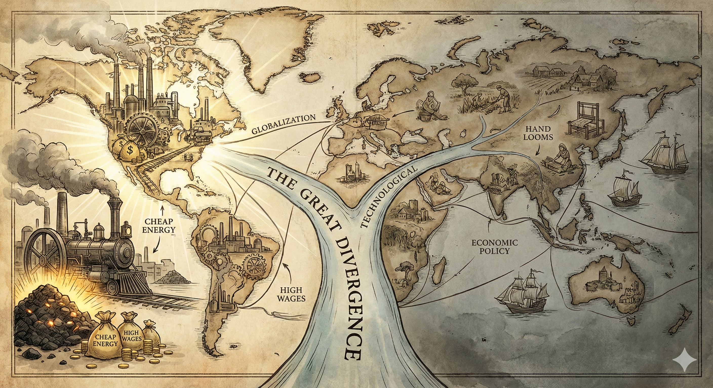
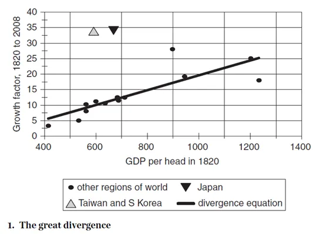
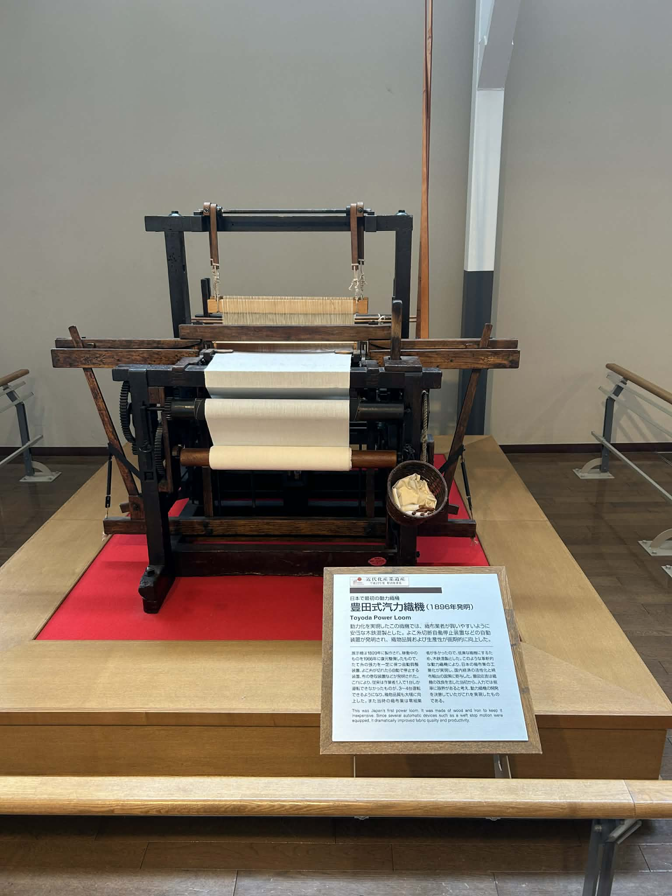
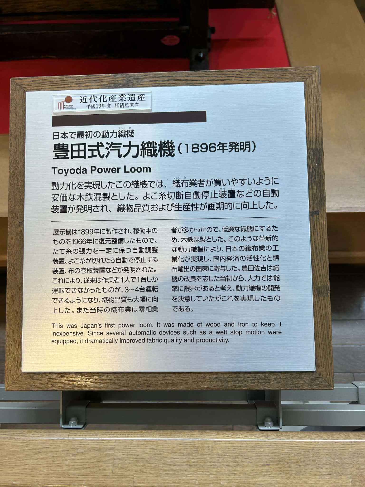

  

《Global Economic History: a Very Short Introduction》是紐約大學阿布達比分校的經濟史教授Robert C. Allen在2011年為牛津大學出版社「A Very Short Introduction」系列所撰寫的導論書籍，介紹自大航海時代開始的經濟發展史，由淺入深地讓讀者對全球經濟和各大洲的發展史有初步掌握。本書不只在Google Scholar上有極高的引用數，網路上幾個可以找到的[經濟史書評](https://eh.net/book_reviews/global-economic-history-a-very-short-introduction/)也都普遍給予正評。

Allen教授曾任教於牛津大學，退休後才轉到紐約大學阿布達比分校。其著名的研究領域是英國工業革命，最有名的就是他對英國工業革命的「high-wage economy假說」：英國是因為要素相對價格高---工資對資本的相對價格高---導致英國最先研發節省勞力、資本集中的科技。近期他似乎也開始研究西亞歷史，在American Economic Review上發了一篇美索布達尼亞政府形成原因的文章〈The Economic Origins of Government〉，可謂經濟史之光（？）。

{width=80% fig-align="center"}

以下我會簡短帶過本書的主題跟架構，最後討論幾個我特別有興趣的概念跟想法。

 

# 本書主題與架構

本書雖名為全球經濟史，但實際內容聚焦在大航海時代到今日的經濟發展史（這是我開始看才知道的，哈），想了解中古或古代史的讀者請左轉。

Allen在第一章「The Great Divergence」指出當今的全球財富的分配不均來自15世紀末歐洲人開始的大航海時代，之後歐洲跟非歐洲地區便開展了**The Great Divergence**。自此開始，他粗略將全球經濟史分為三個時期：

1. **Mercantilist Era（1500–1800）**：西歐國家擴展海外殖民地，提倡貿易跟保護主義。這時還未有現代提倡經濟發展的概念。

2. **Catch-up （1800~1900）**：英國已經開始進入工業化的社會，打敗其他歐陸的產業；同時西歐國家因為拿破崙戰爭結束，開始追趕英國，他們跟剛獨立的美國都採用了四個「Standard Policies」：building transportation infrastructure、the erection of an external tariff to protect their industries from British competition、the chartering of banks to stabilize the currency and finance industrial investment、the establishment of mass education to upgrade the labour force。
    值得注意的是，到了19世紀末期和20世紀，這些使得西歐跟美國國家成功的Standard Package，因為制度或是經濟條件改變，已經漸漸失效（原因後面會詳述），導致試圖效仿的拉美國家成果相當有限。

3. **Big-push （1900~Present）**：到了接近20世紀，剩下的後進國家為了追趕先進國家，其策略是Big Push，由上而下地規劃產業政策、在經濟條件還未跟上時就採用先進國家的科技等。成功的國家涵蓋日本、韓國、台灣、今日的中國（正在努力）、部分的蘇聯等。

以下是書中The Great Divergence的圖，可以看出19世紀的經濟發展幾乎決定了今日的發展，除了成功Big Push的國家。

{fig-align="center" fig-width=50%}

  

第一章接著概述幾個跟經濟成長有關的概念討論，算是書中相對著墨較深的主題。

第一是工業化和去工業化（de-industrialization）扮演了經濟成長的引擎，當歐洲開始使用機器而進入工業化時，透過簡單的比較利益原則，那些被殖民地（如印度）跟傳統帝國（中國或鄂圖曼土耳其帝國等）都被「去工業化」了，反而讓這些地方進入低度發展（underdevelopment）。

第二是實質薪資（real wage）的計算，這是Allen的一大學術貢獻，也是後來較受爭議的論點。他用各地區得以恰好生存的一籃子食物---bare-bone subsistence---為基礎，計算各時期和各地區的工人薪資可以買幾個籃子，以此計算其實質薪資高低。他發現英國在工業革命前就已經有高於歐陸和亞洲國家的實質薪資，並推論這導致英國人研發了節省勞力的科技。

有了第一章經濟發展的綜觀圖像後，後續章節他先討論西歐在海外探險中的興起、英國工業革命。美洲、非洲則獨立出章節，最後幾章討論big push以及為何standard package後來會失效。

接下來我回顧幾個我認為比較有趣的主題。

  

## 歷史的機遇：第一波全球化

很多社會科學家喜歡找通則性的理論來解釋經濟發展，例如制度、地理、文化等等，不管是何者，似乎看在歷史學家眼中都不完整。事實上，我們必須先好好描繪地理大發現對西歐國家的影響。

因為三桅帆船（full-rigged ship）的發明，遠洋航海變得可能。15世紀末的探險者來自西班牙跟葡萄牙，如da Gama和Columbus；這兩國最早開始在中南美洲設立殖民地和東印度公司。而英國跟荷蘭則在17世紀抵達東印度，加入海外冒險的行列，擊敗西班牙與葡萄牙的霸權地位。

人類歷史上的初次全球化對於「葡西」和「荷英」兩組國家有迴異的影響，前者在南美發現大量白銀，然而白銀是不利於產業發展的商品，讓兩國經歷高通膨且弱化產業競爭力；反之，後者則透過貿易壯大了自己的產業，為工業革命奠基。奠基之處在於，因為商業活絡，因此勞動市場更為緊繃、農業和能源的科技開始革新、人力資本（教育）的投資增加等。像這樣的經濟發展結果，確實只能用歷史的機遇來解釋。

  

## 英國的工業革命

Allen在第三章「The Industrial Revolution」起頭一樣略為貶抑那些經濟學家喜愛的制度解釋，他舉例說明英國在18世紀即便有國會，不僅可投票人口僅佔英格蘭人口3~5%，國王權力仍非常大，對民間的壓制和財產權的威脅不亞於法國。[^1] 然而，某些政策提倡了英國的經濟發展，包含支持軍隊拓展海外殖民地跟海外貿易、壓制國內反對新機器的運動、侵犯財產權以建設運河渠道等。至於科學文化蓬勃發展一解釋，他則持中庸態度，認為確實有科學社群的發展，但實際上有多少人參與其中仍無定論。

[^1]: 有一說認為法國君王權力大，所以財產權保障差。

那到底為甚麼英國最先工業革命呢？合併第五章「The Great Empires」的解釋，大概有幾個因素（真要講，這方面的解釋多如牛毛，我只列出他提到的幾個）：

1. 全球化(如上述)已經讓此地的經濟蓬勃發展。
2. California School認為，英國的經濟重心地理上靠近煤炭產地是一大關鍵，讓英格蘭得以使用相對低廉的方式使用蒸汽機跟後續的科技，這是其他古老帝國---如中國---未有的優勢。
3. Allen的high wage假說認為，英國的高實質工資為全球之最，簡單的要素相對價格之下，合併第二點的煤炭使用，讓英國商人更有誘因採用節省勞力的機器。
4. 從紐康門蒸汽機開始，即便一開始僅僅是想抽乾礦坑的水，但它是一個general-purpose technology （GPT），到19世紀被使用到火車跟船上，大幅提升了運輸效率跟生產力。

第三點他用了棉花業來解釋，認為最早採用機器的目的是yarn spinning，跟蒸汽機無關，因為棉花spin愈多次品質愈好，但手工相當費力。既然這是一個製棉業者皆知的事情，英國人卻有動機不斷嘗試使用機器。這個案例乍聽之下很有說服力，而且他採用了令人信服的經濟理論。不過，後續的研究已經提出不少質疑，Jane Humphries與Judy Z. Stephenson教授的數篇文章給了更精準的薪資計算，指出英國的實質薪資並非歐洲之最。[^2]

[^2]: 幾篇反對Allen的論點的文章

    - Stephenson, J. Z. (2018). ‘Real’ wages? Contractors, workers, and pay in London building trades, 1650–1800. _The Economic History Review_, _71_(1), 106–132.
    - Stephenson, J. Z. (2019). Mistaken wages: the cost of labour in the early modern English economy, a reply to Robert C. Allen. _The Economic History Review_, _72_(2), 755–769.
    - Jane Humphries, Jacob Weisdorf, Unreal Wages? Real Income and Economic Growth in England, 1260–1850, _The Economic Journal_, Volume 129, Issue 623, October 2019, Pages 2867–2887.
    - 整理反駁Allen的中文筆記[https://zhuanlan.zhihu.com/p/45695611](https://zhuanlan.zhihu.com/p/45695611)

  

## 西歐歐陸國家與美國的追趕

Allen在第四章「The Ascent of the Rich」討論西歐歐陸國家跟美國是如何在19世紀追趕上英國的。他再次貶抑某些institutionalist所說「法國大革命跟拿破崙戰敗後，當地的舊制度已經被掃除」一觀點。他注重西歐國家追趕英國的standard policies，這些政策也在美國實施，提倡者包含Hamilton，曾去過美國一趟的德國國民經濟學者List。

這些政策跟英國迴異之處主要在於「追趕」（Catch-up）的性質。舉例來說，investment bank這類提供長期工業資本的銀行僅存在於西歐，而英國工業革命過程中並沒有；在當時的普魯士，這種銀行會介入廠商的營運、提供長期融資等，跟Alexander Gerschenkron的觀點一致。同時，西歐跟美國在執行standard policies時，本國的廠商都有充分機會發展，例如汽車業跟鐵路發展時，相關的鋼鐵業可以同時發展等。其他還有大規模教育提倡學術研究...等，也跟當時民族主義和國家統一的潮流有關。

  

## 為甚麼其他地區在工業革命同時未能採用新科技？

在第五章「The Great Empire」，Allen討論古老的文明，例如印度、鄂圖曼土耳其、中國等地，過去也有繁榮的科技發展，但為何他們未能採用資本密集的新科技？

Allen延續他的high wage說，認為其他地區並沒有歐洲那樣的要素相對價格結構，也沒有煤炭能源的地理優勢等。而在被殖民地，因為簡單的比較利益原則，加上蒸汽船的發展與國際市場整合，國際市場競爭加劇之下，他們無法跟殖民母國採用新科技的製造業競爭，導致去工業化。至於在當時仍有效的standard policies，在被殖民地自然無法實施，即便實施了，受益的廠商也是殖民母國，而非被殖民者的廠商。

  

## 為甚麼Standard Policies會漸漸失效？日本為何成功？

後面幾個章節，尤其拉美的章節，除了地理因素跟殖民遺緒，Allen解釋為何後來Standard Policies會失效。

1. 到了19世紀後期，先進國家的科技漸趨資本密集，這對於還處在相對低度發展、勞力豐沛的地區而言，他們毫無誘因採用之，即便採用了收益也不高。
2. 他以minimum efficient scale的概念，認為先進國家的產業已經進展到需要極大的規模才能達到長期成本線的低點，這對後進國家來說幾乎不可能。
3. 類似依賴理論所說，殖民遺緒導致的初級製品產業在國際市場上較無市場力量，價格低等。

至於日本為何得以成功？Allen繼續使用要素價格的理論，認為日本的產業在引進新科技時，會試圖修改，使其符合日本的經濟條件，包含減少鋼鐵零件改用木頭、採用JIT製程等。到戰後，Allen也解釋說日本透過由上而下的發展模式，推進到minimum efficient scale。

這點我上次到名古屋的Toyota Museum時特別有感，日本真的是跟奇蹟一般在短短幾年內改出煉鐵廠、造出織布機和汽車。下圖是那時拍的第一台動力織布機展品。

::: {#fig-powerloom layout-ncol=2}

{#fig-loom}

{#fig-intro}

第一台Toyota織布機（power loom）的展示品（2024年於名古屋觀光時攝於Toyota Museum）。[^3]
:::

[^3]: 這台其實是Weaving而非Spinning Machine，但仔細看導覽板板的翻譯（由Gemini協助）可知日本人的technology adoption巧思：

    日本第一台動力織機豐田式汽力織機（1896 年發明）
    這台實現了動力化的織機，為了讓當時的織布業者能輕鬆購入，特別採用了低成本的「木鐵構造」。隨著「緯紗斷裂自動停止裝置」等自動化設備的發明，織物的品質與生產力均獲得了劃時代的提升。
    
    詳細說明: 
    本展示機製造於1899年，並於1966年將當時仍在運作的機台進行了復原與整修。此機台發明了多項關鍵技術，包含能讓「經紗」保持固定力的自動調整裝置、當「緯紗」斷裂時會自動停機的裝置，以及布料捲取裝置等。 藉由這些技術，以往一名作業員只能操作一台機器，進步到可同時操作3至4台，且織物品質也大幅提升。此外，由於當時的織布業多為小規模經營，為了提供價格低廉的織機，機身採用了木材與鋼鐵混製的結構。這類革新動力織機的出現，促成了日本織布業的工業化，不僅活絡了國內經濟，更對當時「棉布出口」的國家政策做出了重大貢獻。豐田佐吉（註：Toyota創辦人）從立志改良織機之初，就認為人力操作的效率有限，因此決心開發動力織機，而這台機器正是他實踐理想的成果。

  

--- 

# 書寫風格與架構

本書的書寫風格相當簡潔易懂，沒有落落長的句子需要拆解，只需要把各種作物跟工業製品名稱搞懂即可，非常適合我這種初學者閱讀。Allen用三個階段（Mercantilist、Catch-up、Big-push）以及Standard Policies、要素相對價格等概念貫穿全書，讓閱讀的時候不覺主題太發散。他採取較為經濟理論的解釋也讓我信服，每次翻開這本書都會令我想趕快往後翻閱，引人入勝。另外，Allen在前半討論一般性的理論時，他會把其他相關理論納入討論，即便他不同意，也可以讓讀者做個比較，觀點較為中庸。

不過，本書仍有幾個小缺點：首先，作為「a Very Short Introduction」，要用短短的147頁談全球經濟，自然要捨棄很多細節，故行文中幾乎每一句都是重點，卻不太有例子佐證；在此，我並非要強調內容難以理解，而是我明白每個句子背後都暗藏很多例子細節，但就需要讀者到最後的Further Reading去找了。其次，我隱約可以讀出Allen最了解的是歐美跟拉美，他對這邊的分析比較細緻，會分區域討論其經濟狀況、經濟條件的影響等，但對東亞、撒哈拉以南非洲，感覺他僅是大而化之地講過去，甚至有點不清楚。第三、high wage economy的論點乍聽之下很有說服力，但我會覺得他過於著重自己的觀點，未提多不勝數的其他理論。

  

--- 

# 心得感想

早在之前讀Rodrik的全球化矛盾跟Polanyi的鉅變時，我就一直很想多了解全球化和各國產業發展的歷史，這本書恰好補足我這方面的知識，讓我可以對全球經濟發展有個綜觀理解。感覺這次也選對書了！

## 後進國家的發展策略

以前上經濟史相關課程時，教授曾說很多後進國家喜歡發展鋼鐵、汽車工業、棉業等，也喜歡搞所謂進口替代等保護主義的發展策略，卻未思考自己國家的比較利益所在。讀完本書我才了解到，因為先進國家們即便並未有意識地考慮這些Standard Policies，但他們的發展途徑確實是從這些政策開始，後進國家在發展的過程中才一窩蜂想學習這些政策。

如此一來，就有幾個延伸的主題可以討論：

第一、這個後進國對先進國政策的「學習」過程是怎麼來的？這組Standard Policies是如何在西歐各國和東亞國家、蘇聯等散播？

第二、因為Allen用「Policies」來貫穿全文，但也應該思考這些政策實施真的都是由上而下的嗎？應該有很多產業也是由民間推動的吧？例如過去上臺灣經濟史課程時，有學過日據時期製鞋業、帽業、製茶業的變遷，這些跟政府政策似乎沒多大關聯。

 

## (去)工業化的原因

如前段所述，礙於篇幅，Allen很多地方他僅快速帶過。其中我很感興趣的是「製造業如何可以是一個經濟發展的驅力呢？」要怎麼理解工業化的過程必然會帶來更多成長呢？或許答案很簡單，但作為導論書籍，需要我自己再找資源。

另一個則是「為何面對殖民母國的競爭，去工業化會發生，而非產業升級？」就殖民的關係而言，或許很容易理解，因為被殖民者不僅是經濟上弱勢，政治上應該也會受壓迫，自然很難跟母國廠商公平競爭（據說英國對印度就是如此），但Allen也提鄂圖曼土耳其帝國即便未被殖民，仍被「去工業化」。

所以，面對國際市場開放的競爭，產業升級的條件是甚麼？甚麼時候反而會「產業降級」？今日美國勞動經濟學跟貿易經濟學的一大題目是「China Shock」，也有人研究日本在戰後高經濟成長時對美國的「Japan Shock」。雖然美國當時採用了貿易政策，如自願出口限制或廣場協議等，去限制日本，但後續似乎也沒有對日本抱持那麼負面的態度，這個差異該如何解釋？

最後，如同有一說認為華碩跟宏碁當初是先在歐洲開闢市場，才有機會壯大產量，Allen在全書最後一頁，以簡短兩句話透漏了市場的大小是產業得以發展的關鍵。仔細想想，才在2011年，Allen早已參透了China Shock這一主題的內在邏輯：

> These countries (註: Big-push成功發展的國家) have avoided the inefficiencies that Latin America has endured in trying to shoe-horn modern technology into small economies either because they were so large that they could absorb the output of efficient facilities or because they were given access to the American market at the expense of American production. (p.147)

### 社會科學家與歷史學家的對話

上面提過，我隱約注意到Allen貶低某些社會科學中流行的經濟發展理論，認為他們太注重特定變因，如一國之內的制度，而非歷史的偶然性和全球化的機遇。舉Acemoglu and Robinson的《國家為甚麼會失敗》一書為例，他們以廣納性制度（inclusive institution）來解釋所有經濟發展，或許可以提倡科技進步、保護產權的政經制度確實是當今富裕國家的經濟發展模式，但光是在英國的例子中就站不住腳，跟歷史學家的看法大異其趣。廣納/榨取制度論的最佳例子，或許是北美跟南美的差異，南美洲的確受殖民的榨取制度禍害頗深，北美則始終有相對廣納的環境。

有趣的是，我似乎在社會科學的課堂上更常聽到的是搬出各種理論互相比較，而非像Allen這樣，以史料來比對。

  

---

# 結語

如同這篇[Economic History Association上的書評](https://eh.net/book_reviews/global-economic-history-a-very-short-introduction/)所述，本書仍抱持主流的經濟學視角，未能考慮工業革命初期的苦痛（如Polanyi所強調）、未能考慮環保和永續成長等。畢竟篇幅有限，但我們也應該反思經濟成長和市場經濟的雙面特性。

不過，閱讀本書讓我再次確認，這樣的經濟學才是我喜歡讀的，既有歷史實例又與理論對話，不會流於形式。也跟我心中比較個殊式（ideographic）、或是唯名論的哲學想法相互呼應。

> Economic history is the queen of the social sciences. Her subject is The Nature and Causes of the Wealth of Nations, the title of Adam Smith’s great book. Economists seek the ‘causes’ in a timeless theory of economic development, while economic historians find them in a dynamic process of historical change. (p. 1)

