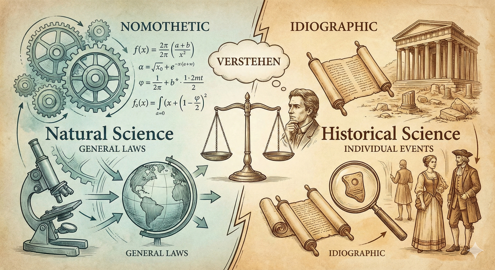

---

今天是初五，下周也要開學了，打算用寫作為寒假的閱讀作結。

以前恰好在長頸鹿拓樸學的哲（科）普文〈[韋伯摘要一：黑格爾與宗教於羅謝方法論之影響](https://www.facebook.com/groups/2694791024074207/permalink/3150612491825389/?mibextid=uJjRxr)〉中，讀到19世紀末與20世紀初新康德主義（Neo-Kantianism）中西南學派（Southwest School）對科學和科學方法論的觀點。裡面針對自然科學跟社會科學分野的論點當時就引起我很大的興趣，不過始終未去深究。近期可能肇因讀了太多經濟學理論，開始閱讀Ken Morrison的《古典社會學巨擘》（Marx, Durkheim, Weber：Formations of Modern Social Thought），並在韋伯的章節再次讀到西南學派，便花了一天時間盡量搞懂新康德主義，尤其是西南學派的想法，也嘗試把筆記撰成文章整理在這，順便讓自己重整一下思緒。

以下主要按照Ken Morrison的《古典社會學巨擘》中第四章〈韋伯〉的西南學派內容加以整理後撰寫，並搭配[史丹佛哲學百科的Neo-Kantianism](https://plato.stanford.edu/entries/neo-kantianism/)等網站以求內容正確。但以我一日西南學派迷而言，新康德主義的脈絡真不好理解，他們的知識論論辯參雜了相當抽象且繁雜（精妙?）的概念、以及對康德哲學思想的「超越」（他們很喜歡這麼說），我未能全部瞭解，僅按照我有興趣的「自然科學與社會/歷史科學的分野」一主題來整理並理解。

{#fig-cover-pic width=80%}

 

# 新康德主義的脈絡

在19世紀末，自然科學跟實證主義在各種科學法則上的發現，使其取得壓倒性的學術權威，傳統的學科如哲學、歷史學、政治經濟學等的正當性備受威脅。此外，黑格爾那種唯心的辯證法和歷史哲學，因為過於抽象、難以跟現實連結已經飽受批評。

在這個脈絡下，德國遂有一群人以「重返康德、超越康德」為宗旨，對上述實證主義的自然科學方法產生反動，他們的目標通常包含重新正當化歷史學知識，也比較唯心，在意人文科學的先驗基礎等；[^1] 即便關注的重心按學派有所不同[註3]，但普遍對哲學史、科學哲學、知識論有獨到見解。這就是新康德主義（Neo-Kantianism），按照地理位置跟大學機構，主要的學派包含馬堡學派（Marburg School）和西南學派（Southwest School）。根據Ken Morrison的書本，韋伯的詮釋社會學受後者影響頗大。

[^1]: 大多時候我的詞彙會用「歷史學」和「歷史科學」，因為新康德主義者使用的詞彙還是強調歷史學跟自然科學的對比（可見史丹佛哲學百科的用詞），我猜那個時代究竟社會科學的內容還不那麼清晰吧。

西南學派最具代表性的哲學家有兩位：文德爾班（Wilhelm Windelband，1848–1915）與李克特（Heinrich John Rickert 1863–1936）。他們的目標都是刻劃自然科學跟歷史［科］學的差異，嘗試將歷史學從自然科學方法中解放出來，以此正當化歷史研究，並更進一步定位了歷史學研究［應該］是甚麼。因此，以下我會以「自然科學與社會科學的分野」以及「如何正當化歷史［科］學」兩個主要問題，分述文德爾班與李克特兩位西南學派主要哲學家的論點，結尾穿插我個人的想法。

  

# 文德爾班

## 研究對象與研究主題：兩種現實（reality）或兩種知識

文德爾班區分了兩種知識：

**第一種是自然科學的知識**，這是可觀察世界的知識。目的是在具體世界中找到現象的原因和法則。

**第二種是歷史的知識**，這是有關人類價值與倫理的知識，包含倫理和判斷，永遠與「不能直接觀察到的對象」有關。而且人類行為背後的標準或是價值，會因為不同社會跟歷史緣由而不同，這是社會與歷史科學的「專屬主題」。這並不是說歷史學研究等同倫理學那類規範性（normative）研究，而是說文德爾班認為歷史學的研究標的總是跟行為背後的價值有關。

第二種知識或許需要以例子以茲說明「為何歷史會跟價值有關」。他們的論點在於，談論歷史時總是會討論當時某些事物的象徵意義（aka價值），例如皇冠上的寶石代表秩序或是美等等，這意涵代表的當時代或社會的某種價值。

## 兩種科學方法論

文德爾班不僅區分了自然科學與歷史科學的研究對象/主題，他進一步說明兩種科學方法論：

**律則式的（nomothetic）方法**：這個方法聚焦在找出不同對象之間的相同性（commonalities），用盡量少的概念，去包含盡量多的對象。目標在於確認經驗事實是否符合理論假設。因此，這個方法有會有generalizing的傾向，通常為自然科學所用。

**個殊式的（ideographic）方法**：這個方法則將研究標的鎖定在單一的事件或對象，盡量把事件發生的圖像完整描繪，以此判斷事件發生的動機跟緣由。

舉例來說，牛頓的物理學，說明了「所有」石頭---無論表面是否崎嶇---落下的法則；相比之下，歷史學會盡量詳實說明跟研究羅馬的凱薩崛起和被暗殺的前因後果，或是研究西歐封建社會的沒落等特殊案例。文德爾班並未說明兩個方法孰優孰劣，他保持相對中庸的看法，認為兩者並重才能取得真實世界的圖像。

## 文德爾班的影響

Ken Morrsion認為，這些論點有了下列影響（我不確定文氏本身是否明確講出這些觀點）：

1. 人類對世界的認知牽涉到價值、判斷、詮釋等。
2. 人類社會的行動「不可以」被化約成以效用論這種單一的機械性動機（原因如1.所示）。

  

# 李克特

李克特是文德爾班的學生，他站在老師的立場上進一步強化並完整了老師的學說，他也跟韋伯有些交流。我認為李克特的觀點似乎比文德爾班更激進一點。

## 科學知識論: 批評自然科學來自直接的觀察

他認為人必定是「判斷先於觀察」（judgment before knowing），所以，事實本身是經由判斷才會再現，必然牽涉到某種詮釋。以此為基礎，他減弱了自然科學的正當性，並得到一個較激進的結論：「人類的價值判斷無法由自然科學那種律則的方式所掌握，所以歷史學比物理學更能掌握真實。」

## 自然科學與歷史學的分野

李克特跟文德爾班的看法相同，並加強了某些論點。在兩種科學方法論上，他進一步批評自然科學那種generalizing的方法喪失了個案特殊性，為一大缺點；反之歷史科學致力於解釋individual non-recurring events。在概念形構（concept formation）上，李克特認為自然科學的概念是將經驗現實簡而化之，排除個體的構成要素；而歷史學的概念是盡可能貼近現實的特殊案例愈好，然而也不是說要求複雜的知識（那我們怎麼會能概念化任何歷史事件呢？），他只是認為概念是出自於個案，而非出自多個個案的一般特性。最後，李克特認為自然科學找尋事實性的知識，社會科學關心的是價值的知識，因為人永遠受到價值所形塑而產生行動。**因此，有無價值是「兩種科學」的關鍵差異**。

他甚至認為，透過概念形構，我們超越了觀察本身。故當自然科學描繪出由簡單元素形成的圖像，世界的具體性不見了，但人的經驗卻包含著世界中具體的種種。

那倒底歷史學知識和律則的知識有甚麼關係呢？李克特認為即便「概念」是以個殊的案例所發展，仍會跟一般性的概念或事物有連結。舉凱薩為例，他會跟「暗殺」這種一般的概念有關，也會跟更大的「羅馬帝國興起」一個殊案例有關。

在這個看法之上，當我們有不同史家描繪的歷史案例知識時，需要重構一套知識論，來說明怎麼樣分辨哪些（歷史）知識是有效的。而且，如果史家都有不同觀察跟描述時，我們更難取得共識跟客觀性，甚至失去generalizing或取得歷史法則的可能。這方面確實是西南學派的一個哲學主題，下段根據史丹佛哲學百科和網路資源整理之。

# 西南學派的歷史學知識論：價值相關

延續康德哲學討論了自然科學的先驗基礎等等（我並沒有太多涉獵），我直接引史丹佛百科的說法如下：

> The defining claim of SW (Southwest) Neo-Kantianism is that there are universally valid norms, and every universally valid norm has an a priori ground.
...For natural science, the law of causality is an a priori norm; for history (see section 3.3), it is a priori that there are universal values that make certain individuals historically significant (Rickert 1902: 334). Similarly, there are universally binding norms in ethics and aesthetics, which make it possible that certain actions and emotions are universally valid.

如上所述，因為新康德主義者致力於研究知識---尤其人文或歷史學---的先驗基礎，加上西南學派將哲學的目的定為找到學科的先驗基礎（通常是某個預設價值或公設等，自然科學可能就是因果律），[^2] 故就正當化歷史學研究這方面，他們引入像是「美」之類的真理或價值（他們喜歡用價值這個詞彙）支撐，認為當有這些共通的終極先驗價值在，歷史學家們自然會有共識，會同意特定歷史事件的重要性或概念等等，而不一定要generalizing跟發現法則才能算為有效的知識。同時，西南學派也強調了每個社會都會有其價值，導致了不同社會的歷史學研究興趣之差異，這也是李克特所說的「價值相關」（value relevance）。但要注意的是，馬堡學派並不同意「知識不需要generalizing、不需要發現法則」這點，因此這可以說是西南學派自己對科學知識的獨特觀點。[^3]

[^2]: 張存華（2015）: 「實證科學的正確性只能從已經預設了的知識真性上獲得證實。如何透過價值概念﹐對知識真性提出說明﹐為西南學派在知識論上首要處理的哲學問題。...審視 Windelband 的這段話﹐『哲學並不把價值當作事實（Tatsaschen）﹐而是當作規範（Normen） 來看待。因此﹐哲學必須把自己的使命當作‘立法’（Gesetzgebung）來發揚』」

[^3]: 這段是我自己吸收後整理的，我似乎難以找到更清楚說明西南學派對歷史學知識基礎的觀點（是否需要generalizing等）。故參考了史丹佛百科（注重section 3.3）、張正修老師的小文章、張存華老師的國科會計畫所撰寫，如下References。

如果瞭解了上面的脈絡，可以發現西南學派那套價值相關的說法，跟韋伯詮釋社會學、社會行動的基礎觀點有很多相關之處。根據Ken Morrison的書，韋伯是在這個方法論論辯的脈絡中思考他的理論，但本文就不再贅述了，這方面網路上有很多社會學科普文章。

  

--- 

# 我的想法

我當時讀到針對西南學派的介紹，主要是被「律則式 vs. 個殊式」的知識區分所經驗，即便後來仔細想想，這仍屬唯名論跟唯實論之爭的另一種形式，我仍覺得這個洞見刻劃了很多社會科學理論的兩個矛盾取向，當我閱讀更多歷史學著作時，也逐漸體會了這個分別確實存在。

正如同凱因斯所說的：

> The study of economics does not seem to require any specialized gifts of an unusually high order. Is it not, intellectually regarded, a very easy subject compared with the higher branches of philosophy or pure science? An easy subject, at which very few excel! The paradox finds its explanation, perhaps, in that the master-economist must possess a rare combination of gifts. He must be mathematician, historian, statesman, philosopher — in some degree. He must understand symbols and speak in words. He must contemplate the particular in terms of the general, and touch abstract and concrete in the same flight of thought. He must study the present in the light of the past for the purposes of the future. No part of man’s nature or his institutions must lie entirely outside his regard. He must be purposeful and disinterested in a simultaneous mood; as aloof and incorruptible as an artist, vet sometimes as near the earth as a politician.

雖然現代人似乎已經把自然科學方法奉為圭臬，幾乎不管甚麼是個殊的科學了，但這段話跟西南學派的觀點，才更貼切地描述社會科學或人文學科研究的（矛盾）本質。

  

其次，我認為（傳統）經濟學理論總是喜歡用一套律則式的、沒有人類思考內涵的決策理論套用在人的行為上。即便是當今跨學科整合的時代，經濟學跟政治學仍有愈來愈仰賴律則式解釋的傾向，並意圖用個人的生物和行為基礎解釋行為。我始終對這個看法感到有點不安，並不是說這些解釋跟科學取徑是錯誤的或不應該的，而是這樣的看法在根本上沒能捕捉西南學派所說的「價值」一大主題，更沒有韋伯在《經濟與社會》（Economy and Society）中提出詮釋社會學時，認為人的行為本質是詮釋性的。我們總是要為了行為賦予主觀意義，然後才會有行為。如果這些解釋認為人只須仰賴所謂行為基礎即可，無須瞭解人行為時的想法、判斷、價值等，那我們豈不是跟石頭一樣了嗎？

> Weber drew the conclusion that any form of investigation which reduces human action to its simple external characteristics would be meaningless since it would not capture the tendency of human interpretive understanding. He pointed out that ‘if human conduct is interpreted by using the methods of the objective sciences, this conduct would be no different from the conduct of a boulder falling from a cliff,’ since the boulder is devoid of any understanding. （Morrison英文版p.350）

  

::: {.callout-note title="P.S."}
本文為一日新康德主義迷的整理，若有錯誤之處還請見諒，可隨時來信討論。
:::

---

# References {.unnumbered}

- Morrison, K. (2006). Marx, Weber and Durkheim. Formation of Modern Thought. (中譯: 古典社會學巨擘)
- Heis, Jeremy, “Neo-Kantianism”, The Stanford Encyclopedia of Philosophy (Summer 2018 Edition), Edward N. Zalta (ed.), https://plato.stanford.edu/archives/sum2018/entries/neo-kantianism.
- 張存華 (2015) “價值與歷史 — 新康德主義西南學派的文化哲學.” https://www.grb.gov.tw/search/planDetail?id=11360095
- 張正修 (2021) “自然科學與歷史科學分類是從哲學產生出來的.” 民報. https://www.peoplemedia.tw/news/a6b27cf6-0b1a-41c0-ab6f-6bf71f07a858
- Keynes, J. Essays in Biography.
    內文引用自pp.140--141
