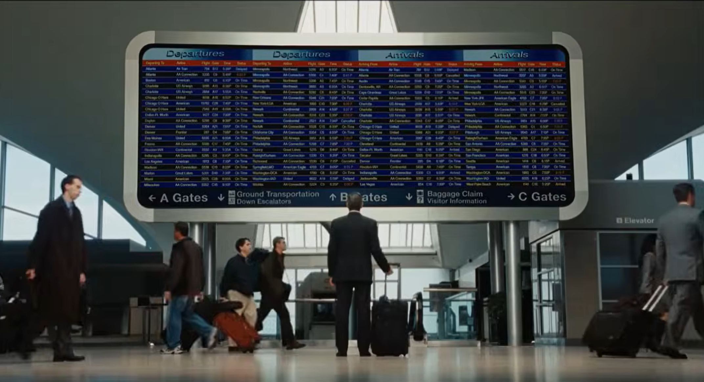

這幾個月花了好多時間搞論文，現在口試結束回過神來，一開個人網站才發現我好久沒寫東西，因為實在太忙了（汗）。感覺以後應該定期更新，至少每個月更新一次；但這樣不如另開一個分類叫做月誌好了（？），值得想想看以後該怎麼組織會比較好。

# 研究與論文

上一篇[文章](../2026-03-20-reflection/index.qmd)中提到，我想試著保持規律的工作和生活步調。這幾個月來我覺得我應該有達到目標，我幾乎每天都9點前起床、晚上1點前睡，早餐常吃隔夜燕麥跟優格，也定期在健身房運動或跟朋友打羽毛球。但這樣的工作流程有讓我研究效率大增嗎？就寫論文來說可能很難說，畢竟這幾個月都是以思考跟閱讀文獻為主，而不是處理雜事（下詳述）。

## 過程

這幾個月忙的事情流水帳記錄下來大概是這樣：我的論文主題是貿易戰對台灣勞動市場的影響。小時候不懂文獻、也還沒去美國交換，就以當下比較有興趣的議題下去想題目。指導教授起初是Y跟Z，兩位的風格也都偏reduced form，其中專長偏貿易的Z並未提供我多少指導（我也很好奇他在想甚麼），然後我就出國交換了。回國後，我開始認真做論文，而這時Z已經離開臺大，所以仍沒有提供任何指導。我花了一學期把原本想好的分析執行完畢後，時間線就快轉到下學期了。我在邊做的過程中，因為在UCB的經驗告訴我，我若更了解貿易文獻會比較好，我遂一直想找熟悉貿易的本校指導教授。到了下學期，在我已經有main results的情況下，我便開始跟系上少數2位trade guys討論指導的可能，他們分別是Ｊ和T老師。

我跟兩位老師聊過後，發現雖然T老師發表好，但他這學期超級忙碌，而且對研究的taste可能比較強烈、對學生要求也更高點，因此在論文方向抵定的情況下有點難配合T老師。至於Ｊ老師，他則覺得可以指導、也可配合我的時辰讓我在７月口試，但他有唯一一個要求：「文章要有至少一個crystallized mechanism」（或故事之類的）。於是整個下學期就圍繞著這個詞彙開始了。

相較Y老師比較輕鬆的指導風格，[^1] Ｊ的要求，用他的話來說就是要「Jazz it up!」，若搭配上面的crystallized mechanism，用一句話來說明的話，就是一篇研究只會賣一個點，那個點本身就是有趣的、重要的，其他結果都是附屬的。換言之，要去蕪存菁，只留在文獻上有貢獻的「菁。」但是知易行難阿，我來回跟Ｊ討論多次、自己讀文獻、也讀了些關於academic presentation tips的文章，[^2] 到現在才稍稍明白實際上我該做甚麼，但未來還需要持續學習就是了。

按照我目前的理解，這個過程要注意這些事情：

- 執行project的過程中即便有確定的題目，你可能會做出數個results，每個都多少在現實或文獻中是有趣的。不過若是要寫成文章，你必須講成一條線性的故事，讓這一切織出一張漂亮的掛毯，所以這個毯子上的花紋不僅要引人注目（i.e.  有文獻或現實的貢獻），還必須被合理地的連接，否則就沒有人會欣賞，變成孤芳自賞的作品。
    - 這個過程必須丟棄掉很多results，或讓他們成為次要的結果，進入appendix。
- 既然要引人注目，就必須像個sales那樣，嘗試讓自己的幾條correlation和更大的敘事、或文獻中衝突的機制連接。例如，宣稱文獻理論中有A和B兩種理論預測，所以這篇文章的係數回答了which one is dominant。
- 因為群眾是很沒耐心的，所以文章（跟presentation）都必須以「破題、引起注意、細節」的方式去撰寫，不能如小說那般開展。Ｊ老師曾說過好幾次「No one cares about what you are doing」，這確實是寫作時需要放在心底的觀念。

即便有這些tips，執行起來還是十分顛簸。起初Ｊ老師先提供AB兩個可能可以生成有相互衝突預測的理論，但我仔細閱讀後發現他們預測的方向雷同。後來我自己提出另一個跟機制有關的C方向，不過因為還需要花很多時間做額外的分析，遂作罷。最後在口試前1個多月，約莫6月初，Ｊ老師建議我去讀一篇方法跟我類似的文章，火力放在我一個比較少人看的inequality outcome，並建議我把文章frame成「沒有人研究positive demand shock and inequality」，我的任務就剩下想出「在文獻跟現實中這個新outcome為何重要」即可。我在一個月內快馬加鞭，根據那篇文章想了新的分析方式，最後在口試前一周才寫完論文和做完簡報，交給口試委員。

好不容易寫完後，我的文章在口試看起來有受到其他trade economist口委的青睞，看來真的有「Jazz it up」了，真的非常感謝Ｊ老師的幫助。

## 文章的Novelty

經過這個過程，我感覺可以統整出三個思考文章novelty的模板

1. 研究一個現實中熱門的議題或新的現象。
2. 說明自己的empirical setting可以test現存的理論或衝突的兩理論預測。
    - 思考這點時要注意到，因為現存的理論必然是解釋現存的現象，所以，通常已經發表的理論會難以完全吻合自己研究的empirical setting。因此，我們會需要統整現存理論的大方向，最後才能營造處衝突或是理論還未被測試的地方。
3. 說明自己研究一個新的outcome，而且他在文獻跟現實中很重要。

我也再次感覺在臺大鮮少有機會思考甚麼是自己文章的novelty，這一方面可能是這裡每個領域的學術社群都相對小（可能比UCB一個學校都還小），也比較沒有大咖坐鎮。所以大家更常是在瞎子摸象，看著working paper or publication去猜測前沿的文獻漏洞。另一方面，我也確實沒有在甚麼課堂或跟老師的討論中，直接或間接學習到寫文章的方式。莫怪大家都想喝洋墨水（？）

[^1]: 其實我也不知道要怎麼形容這個風格。

[^2]: 我猜Ｊ老師覺得口頭跟我講就夠了，不過我還自己讀了其他資源才有更完整的體悟。我前後大概讀了三個文章/slides：

    - Eliana La Ferrara的[How to present your job market paper](https://www.europeanjobmarketofeconomists.org/uploads/HowToPresent_LaFerrara.pdf)
    - John Cochrane的[Writing tips for PhD students](https://www.johnhcochrane.com/research-all/writing-tips-for-phd-studentsnbsp)，這個似乎是經典。
    - Donald Cox的[The “Big 5”](https://econ.lse.ac.uk/staff/spischke/phds/The%20Big%205.pdf)，這也是經典，很多討論串都會提到。

  

---

# 教育部計畫

最近又到了教育部人文社科計畫選送生出國的月份了，我也在數個月前參加了分享會，收到了幾個學弟妹的問題，有些我認為挺值得紀錄的。

參加這個計畫的人很多有走學術的意向，但實際上到了人生地不熟的歐美頂尖學府，該怎麼做會對於這條路更有幫助呢？我作為一個在學術表現上平庸的人，以我粗淺的觀察，歸納出了幾種模型：**修課學生、RA、指導學生、訪問學人。**

在描述每個模型之前，必須先了解我主要探討的UCB案例的環境。作為有豐沛的研究資源且學生總數巨大的頂尖學府，教授有非常多用人的options。以經濟學來說，他們通常有全職RA（predoc）、博士生、一些大學生小朋友...這些選項，所以，作為交換生的我們，對那邊的教授來說，是uncertainty很高的option。這個思維也可以套用在其他學科，但我今天就以我對經濟系的（更準確來說是UCB經濟系）觀察做個分析。

**第一種模型是「修課學生。」**他們以修課修好為主，使得他們頂多拿到修課推薦信，並且在成績單上增加博班課程的成績。為甚麼有人會想做學術卻只修課呢？這不難理解，到了美國人生地不熟，光顧好自己、適應環境就很難了，遑論做其他事情。這類人可能有其他目標（體驗人生或旅行），但這又是其他因素了。至於博班課程成績是否有用呢？10年前可能有用吧，現在大家都在拚paper發表跟當predoc了，這個signal就變得很弱（但不能說沒用）。

**第二種模型是「RA。」**這些人在認真修課以外，嘗試申請成為~~免費勞工~~兼職研究助理。這個是一個合理而且被往年學長姊所採用的途徑，但我認為這是一個次佳的方式（尤其在經濟系）。首先，就申請上來說，因為老師已經有其他人手（如上所述），所以他們會使用一個從東南亞來的不知名勞工（即便已經免費）的機率真的很低；就算中了，機會可能大多落在新秀助理教授身上（這倒還好）。而如果進到比較教授的大型lab，作為一個菜鳥，也很難跟大教授有多少互動，可能只是一個螺絲釘。雖然總是有人透過這個方式拿到信，甚至重返UCB念博士班，但以ex ante的角度來說，對選送生的不確定性真的很高，導致最後大多情況是無功而返（=我）。當然，更好的方式是「學生+RA」的hybrid模型，讓老師透過修課認識你再當他研究助理。然而這兩個能拿到甚麼強推嗎？再次考慮到他們的outside options，老實說真的很難會是強推，要強推可能就要仰賴自己在修課跟meeting的超凡表現了。所以，這類RA相關的類型mean outcome不高（但仍大於修課學生型）、variance也不大。

**第三種模型是「指導學生。」**這個的意思是受某個老師指導下寫paper。從ex ante角度來說，他的mean outcome會非常高。不過實務上要拿到這個機會仰賴的是領域特性。往年透過這個方式的學生大多是有師徒制風格、更理論取向的領域，這些人也確實有很好的申請結果。

**第四種模型是「訪問學人。」**意指讓自己融入學術社群，和教授或博士生建立連結。這個也是mean outcome會特別高的一個途徑，不過這對個人能力的方方面面門檻都較高。要融入學術社群，代表你要具備近乎博士班的研究能力、對特定文獻有掌握、手上有些完成或做到一半的project...等，還有要比較高的英文溝通能力。我認為第四個途徑是過去比較少人提到跟實作的，這也顯現出，在臺灣的環境中要同時滿足這些條件實在很難。

最後我想強調，這些模型都是以我在經濟系的觀察歸納而成，但他們概念上應該都可以在其他學科適用，尤其是這四個模型的mean outcome大小關係。然而，考慮到不是每個學科的情況像經濟學界這麼卷，或許很多學科只須採用「學生+RA」的hybrid模型就可以拿到很好的信了，這點再讓未來的讀者自己判斷罷。

  

---

# 看電影

近半年來在不需要做研究或想放鬆的時候，我開始會找些電影來看。但看著看著，總覺得自己對電影的taste還停留在比較主觀的層次，我頂多從是否跟個人經驗連結、是否跟我學習過的理論（社會科學或哲學）有關、劇情安排是否自洽合理...等簡單的方面切入，難謂有甚麼high-level的判準。不過，我短期內也沒什麼功夫學習甚麼電影欣賞之類的理論了，這事就先擱著吧。

或許，我最強烈的標準是有關「電影風格跟劇情安排」的**內在一致性**吧。電影開頭通常會設立這部作品的世界觀跟風格，可能是搞笑、科幻、懸疑...等，這些我通常都可以接受；但是，當設定完成，後面的劇情推演必須要在這個框架下運作。如果他是搞笑荒謬的走向，那劇情要在他設定的範圍內盡力展現荒誕；若是嚴肅的作品，我會期望他的人物行為要更貼合現實；如果要傳遞愛情中現實與浪漫的拉扯，那我希望他用適當的鋪陳來堆疊和修飾這個觀念。我期待看到導演、編劇、或演員如何把這個設定發揮得淋漓盡致。我認為我的這個taste和我對音樂的偏好雷同，我聽抒情歌的時候，我可不會想聽一個人不斷嘶吼「I miss you」一百次。我可以接受歌曲傳遞思念的情感，但它應該要有適當的起承轉合來堆疊感受。畢竟，現在可不是要寫論文，不需要破題。

即便我缺乏系統性的電影欣賞判準，我還是看了些電影。我盡量從經典電影入手，希望先看看被歷史篩選後留下的「好電影」都是怎麼樣的。在劇情方面，我暫時偏向不要過於嚴肅、相對溫馨的的情節。這半年來，我印象比較深刻的有：型男飛行日誌、歡迎光臨布達佩斯大飯店、西雅圖夜未眠、動物方程式2、以及這幾天看的玩具總動員1--4。

::: {#warn-movie .callout-warning  collapse="false"}
以下心得有雷，請小心閱讀。
:::

## 型男飛行日誌

這部片相當符合我的preference，所以放在第一個講。

劇情大概是這樣：主角Ryan Bingham任職的公司主要業務是協助其他公司開除員工，而他主要的工作即為飛去和即將被開除的員工面談，說服對方接受並簽字。這個工作性質讓Ryan常常要搭飛機，所以Ryan跟他的家人關係不深、也沒有跟任何人有深交；他更喜歡在工作中結交女伴享受暫時且無須負責的歡愉，並以累積飛機里程數後跟機長聊天的機會做為人生目標。一日，公司新聘了大學剛畢業的女員工Natalie Keener，她試圖在公司推行新的遠距模式（用視訊開除員工），並跟隨Ryan到各地學習辭退員工的技術。同時，Ryan也跟一位和他工作模式類似的女強人（？）Alex Goran常常flirting。後來，Keener的建議被公司採用，所以Ryan無法繼續周遊列國，且有了空檔參加姊姊的婚禮。婚禮中他約了Goran當女伴，開始萌生建立穩定的生活和關係的想法。然而，當他承認自己對Goran的迷戀，飛去找她時，才發現Goran早有丈夫跟孩子；Goran因而指責Ryan打壞純屬玩樂的關係，差點毀了自己的家庭生活。落寞的Ryan這時恰好累積到可以和機長聊天的里程數，他卻發現自己一點都不開心。同時公司發現，遠距開除員工的模式讓失業的員工自殺了，遂麻煩Ryan回到四處出差的工作模式。最後，電影結束在Ryan走到機場，看著航班資訊螢幕的身影。

{#fig-up fig-align="center" width="80%"}

事實上，這部片並非我最愛的電影，但它的劇情安排非常符合我偏好的電影形式。所有角色都有鮮明的個性，這在前幾次出場時就設定好了，並透過劇情安排層層堆砌出幾乎是不可避免的、或至少是合理的結局。這點從電影的核心概念上就可以清楚地看到：導演和原作應是想透過遠距模式跟Ryan的心境改變，[^movie] 來凸顯「人與人深度連結的特性」和「人對這種關係的渴望」。就這點來說，電影的情節鋪陳都非常順暢跟合理。

而且，我相當喜歡片名和劇情的巧思。電影跟原著的英文名稱是《Up in the Air》，這句話在英文中的意思是懸而未決或不確定。這部片的搭飛機設定正好契合了字面上的意思，在劇情中段，Ryan無須搭飛機而開始經營人際關係；而在結局，Ryan求愛失敗，他無法跟心愛的人建立深厚的人際關係，又被迫重新開始飛行，於是他再度回到**up in the air**的狀態。不得不說，可能我就是特別偏好充滿細節，同時有主題貫穿全片的電影吧。

讓我有類似感受的作品還有《歡迎光臨布達佩斯大飯店》。他確實是部好看的電影，不過可能主題比較沒有打中我有共鳴的事物吧。

## 西雅圖夜未眠

上述電影的反例我認為是《西雅圖夜未眠》。這部片似乎是個經典，我剛好在Netflix上瀏覽到就點來看了。電影的主題是某種形式的浪漫和現實的對比，在喜劇的包裝下試圖推廣一種類似「一見鍾情」或是「命中注定」的戀愛關係。我覺得，這部片一方面喜劇成分不高（但這當然很主觀）；另一方面，若當成較嚴謹的作品來看，我又覺得角色們的智力低落。裡面為了製造浪漫與現實對比的主要劇情也有些荒謬，甚至有些違反我的道德觀念。[^seatle]

有人說，我可能在開頭沒能讀懂這部片比較喜劇或荒誕的設定；我同意這是有可能的。也有人說應該用時代意義去看這部片。1993年上映時，它想凸顯的是「找個實際的好對象結婚」和「新興的浪漫愛情風潮」之間的衝突，所以才會受大眾喜歡。可能吧，但即便有這種時代意義，我還是不太能接受劇情的推進方式。

[^movie]: 電影是小說改編，所以我說「原作」。電影當然有其他主題，這裡就不贅述。
[^seatle]: 主要劇情之一是女主角為了廣播節目上聽到的男主自述就愛上他，而且一直覺得冥冥之中天注定，還常常引用老愛情電影中的「It's a sign」來合理化各種事情。最後她拋棄跟陪伴她多年、論及婚嫁的好男友，選擇陌生的男主，還一直說「it's like home」。

## 玩具總動員

因為恰好玩具總動員5上映，我便在口試完後複習了前四集，[^toy1] 發現實在是太合我胃口了。我甚至敢說，論溫馨的作品，玩具總動員1--3可能是我短期內的最愛。

### 關於主題 {.unnumbered}

為了討論主題，我一樣先簡述1--3集和（我認為）與主軸最有關的主線劇情。第一集中，Woody面對新玩具Buzz感到異常忌妒，因此陷害Buzz掉落草叢；但他仍抱有良心，冒險從隔壁的壞小孩阿薛手中救了巴斯。第二集中，Woody手壞了，因此深怕自己被Andy丟棄。途中他遇到女牛仔Jesse和馬玩偶Bullseye，他才發現自己的在世界上的收藏價值，導致他對Andy的愛的動搖（或說是想另尋出路）。後來當他決定回去找Andy時，Jesse講述的故事也是一樣的：她曾經被一位女孩愛著，但當女孩長大，即便自己還深愛著女孩，卻仍被拿去捐贈，讓Jesse被封在黑暗的箱子中收藏。第三集更是如此，這回Woody沒有動搖過對Andy的心，不過Andy要上大學了，不僅很少玩玩具，甚至要把玩具收到閣樓。這讓所有玩具都有些氣餒，甚至一度以為被Andy丟掉了，不過他們還是時常說We will be there for Andy。劇情的高潮在結局時完美的收尾，Andy把玩具送給小女孩Bonnie，並和Bonnie一一介紹每個玩具，還久違地好好地玩了他們一次。雖然劇情沒有明說，但玩具們心裏都感覺到，即便Andy很久沒玩我們了，Andy心中還是愛著所有玩具。

我先從主題講起。除了以玩具為主角本身就是新穎且有趣的題材，全片主題恰恰是最能引起我共鳴的事物，那就是**我們都想要（無條件的）愛**。這份愛在玩具身上是非常純粹的，只要能讓主人開心，我們願意冒解體的風險出外冒險。不過，這份單向的愛不保證安全感，我們怎麼知道他還喜歡我們？他會不會被其他玩具吸引？他會不會開始不想玩玩具了？他會不會把我們丟掉？我們是不是要另外找主人？甚至，我們是不是應該放棄尋找任何主人──放棄尋找愛──呢？

這些問題好像似曾相似，我們對愛人的投射──無論是朋友還是戀人──讓我們都曾有這些感受。就算有一天和愛人分離，雖然我們不願意這件事發生，我們希望他還是肯定地說出愛，就像是Andy最後那樣，用行動證明自己的愛。

全片的主題曲，Randy Newman的《You've Got a Friend in Me》，歌詞正是在呼應這個主題：「You've got a friend in me. Some other folks might be a little bit smarter than I am. Bigger and stronger too, maybe. But none of them will ever love you the way I do. You've got a friend in me. 」

> | You've got a friend in me 
> | When the road looks rough ahead
> | And you're miles and miles from your nice warm bed
> | Just remember what your old pal said
> | Boy, you've got a friend in me
> | You've got troubles, I've got 'em too
> | There isn't anything I wouldn't do for you
> | We stick together, we can see it through
> | 'Cause you've got a friend in me
> | Yeah, you've got a friend in me
> | Some other folks might be a little bit smarter than I am
> | Bigger and stronger too, maybe
> | But none of them will ever love you the way I do
> | It's me and you, boy
> | And as the years go by
> | Our friendship will never die
> | You're gonna see, it's our destiny
> | You've got a friend in me
> 
> ── Randy Newman（1995）《You've Got a Friend in Me》

可是，Our friendship will never die是真的有可能的嗎。到了第四集，Woody即便愈來愈少被Bonnie選中，他仍奮力地保全Bonnie最愛的Forky toy，甚至用自己的發聲器交換回Forky。最後，他選擇跟早早放棄跟隨任何主人的Bo Peep一起，畢竟Bonnie已經不需要自己了，自己應該前往下一段旅程。或許，friendship還是沒有消失，只是留在心底。不過我自己的看法更悲觀一些，如果只有留在心中但無法實踐，那更像是漸行漸遠的美好的回憶而已。

### 關於劇情安排和迪士尼動畫電影 {.unnumbered}

我不敢說1--3集是完美的。但是，至少我以看《型男飛行日誌》的標準來說，他的鋪陳都算縝密，最後的情緒堆疊甚至讓我幾乎啜泣。加上角色的個性鮮明、行為合理，真是上乘之作了。

那為甚麼我獨漏第四集呢？經過1--3集的洗禮，我自然是用相同的期待去看第四集。開頭關於Bonnie不適應新學校或不想玩Woody的設定，都是我可以接受的，但接下來的劇情安排跟角色刻畫，顯然跟前三集有巨大落差。

首先，就一般性的劇情推進來說，有不少不知所云的片段跟扁平的新角色。例如有一位新的特技玩具，他出場時提到他的心魔：他被上個主人認為無法做到跟廣告一樣的特技。在故事中段，他被說服要幫助Woody飛越櫃子，而當他開始加速要飛越時，他腦中冒出前主人的臉，他就緊急煞車並掉落在地上（Woody還是飛過去了），接著他就一臉沒事的騎走，好像剛剛的心魔不存在一般。到了劇情結尾，他又要飛過摩天輪。這回他就飛過去了，沒有任何原因。

其次，全片數個劇情的高點，如衝突和反悔...等，都用很怪異的方式強硬推進過去。譬如Bo Beep原先覺得不想回去找胡迪，但她也沒遇到甚麼事件，就突然決定開車回去，而一起臭Woody的玩具也沒有異議。這點也反映在他們的對話上，有好多個角色衝突的地方都只演了沒幾分鐘，就瞬間想通了。這好似是赤裸地把最終結局擺出來給觀眾看那樣，完全喪失前三集的說故事能力。

第三，舊的角色除了Woody和Bo Beep以外，人格特質也被刻意壓扁跟銳化。最好的例子是Buzz；過去的劇情中Buzz是僅次於Woody的玩具領袖，甚至帶著所有玩具一起跑去拯救過Woody。相對於Woody的伶牙俐齒，他可能說的話少些，更帶有軍人背景的果敢個性。這集中他的智商降低非常多，當其他玩具猶豫下一步時，他竟然要仰賴身上的按鈕來得出答案。在許多橋段他也是透過按身上的按鈕來幫自己思考，好像失智老人那樣，要靠一張小卡告訴自己該做甚麼。[^toy2]

綜合以上這幾點，這些因素導致整部片有有過多解釋性跟刻意安排的片段。**所有人都是為了預設好的結局服務，而非他們一起製造了結局。**

這點可以跟年初看的動物方程式2做個對比。裡面也是充斥著毫無人物刻劃的強硬劇情推進跟沒幾分鐘一次的衝突或炫麗的畫面。那時我只覺得，可能迪士尼認為第二集是致敬作品，有很多舊角色的畫面就好；而且是給小孩看的，不需要安排隱晦的主線堆疊，只需安排最後的大拜拜，如同漫威電影那樣。[^toy3] 結果，這次看了玩具總動員4，發現這兩部的套路非常類似，只是玩具總動員的狀況還沒那麼嚴重而已。所以我更傾向於認為，迪士尼現在只想著要給大家炫麗且好懂的電影，根本不用管甚麼劇情鋪陳，只要票賣得出去，觀眾進得來，迪士尼發大財就好。

這背後是甚麼因素呢？玩具總動員1--3也很賣座，甚至前兩部是Pixar做的，所以很難說是電影系列本身的問題，更可能是整體迪士尼策略的影響。難道這真是為了適應當代人低落的注意力，所以刻意營造的嗎？老實說，這讓我對迪士尼感到厭惡。這是電影，不是短影音。

[^toy1]: 小時候看過前三集，第四集則是最近補齊的。
[^toy2]: 不排除Buzz因為常常被摔到，而且從1995至今年事已高，可能真的失智了。
[^toy3]: 我確實沒看過第一集，所以評價可能有點失準。

 

---

# 短影音與真實的人生

提到短影音跟當代人的注意力，我近期看過一個挺喜歡的影片是社會心理學家Jonathan Haidt今年在[紐約大學畢業典禮的演講](https://www.youtube.com/watch?v=2hITZpxhdYs)。主題是「Attention」。影片一開始，他告誡畢業生們不要被社交軟體控制自己的注意力（attention）。當那些科技巨頭不擇手段地想要攫取我們的注意力來賺進大把鈔票時，我們更應該珍視我們的注意力，因為注意力是無價的、是珍貴的。

Haidt在這個點上進一步說明注意力應該被使用的地方。他認為注意力應該用在困難的事情上（hard things），以及現實生活中的人際關係經營上。現代人雖然有歷史上前所未見的通訊能力，甚至可以即時看到地球另一端某人的生活，但卻也感受到更強烈的孤獨感。因為，人們寧願把注意力花在螢幕上，而非現實生活中。弔詭的是，人們這輩子最快樂、印象最深刻的體驗都是與現實中的人有關，鮮少是在螢幕上發生。所以，我們應該更努力地去跟現實中的人們聯絡感情。

在結尾時，他引用了詩人Mary Oliver的一首詩《Instructions for Living a Life.》扣回主題。

> | Pay attention.
> | Be astonished.
> | Tell about it.
> | ── Mary Oliver

我很認同他的話跟觀點。希望以此時時告誡自己：**do hard things, reach out to others, and be the one that makes things happen in the real world。**
